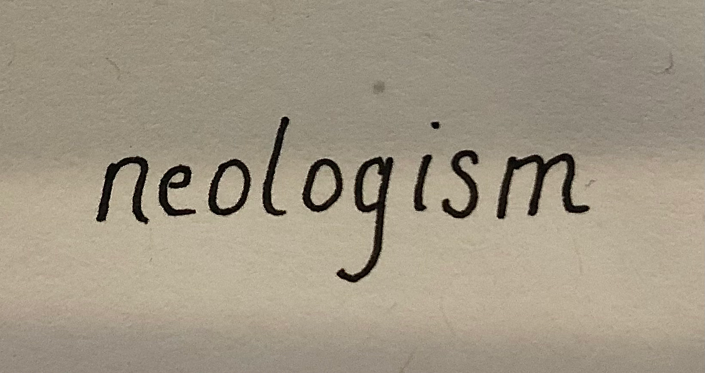
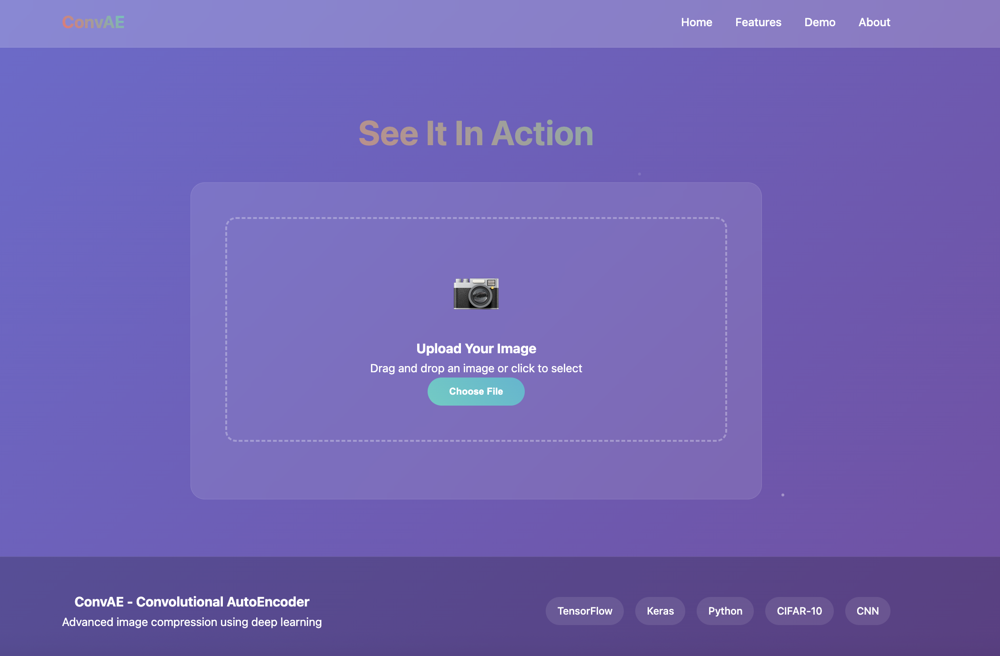
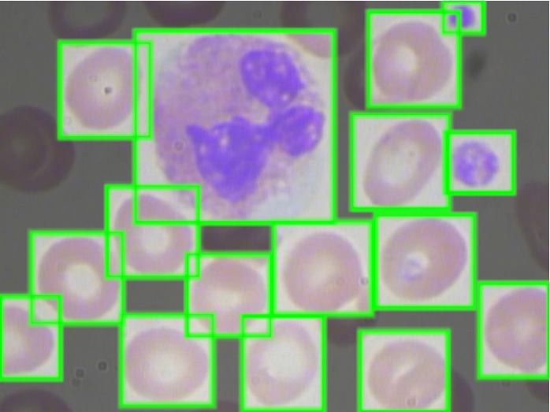
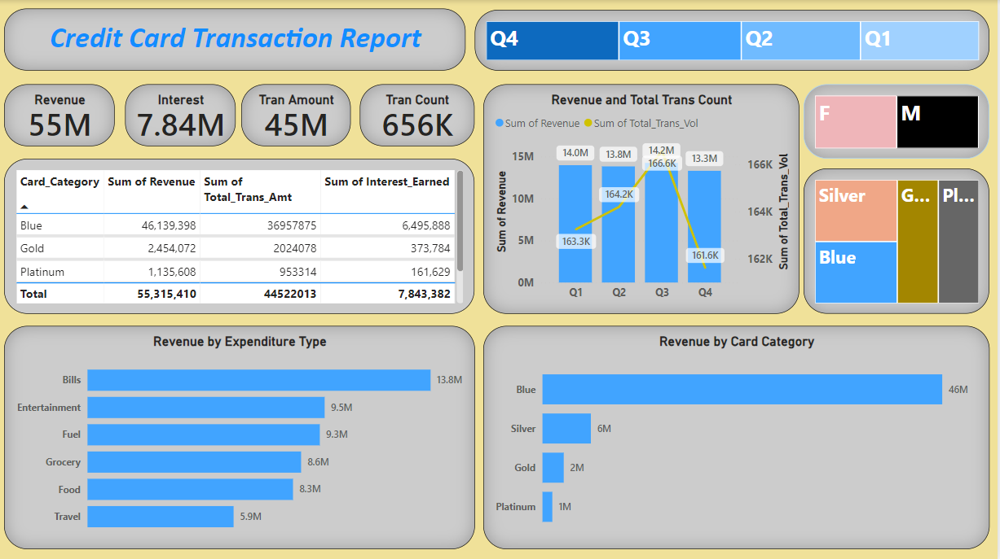
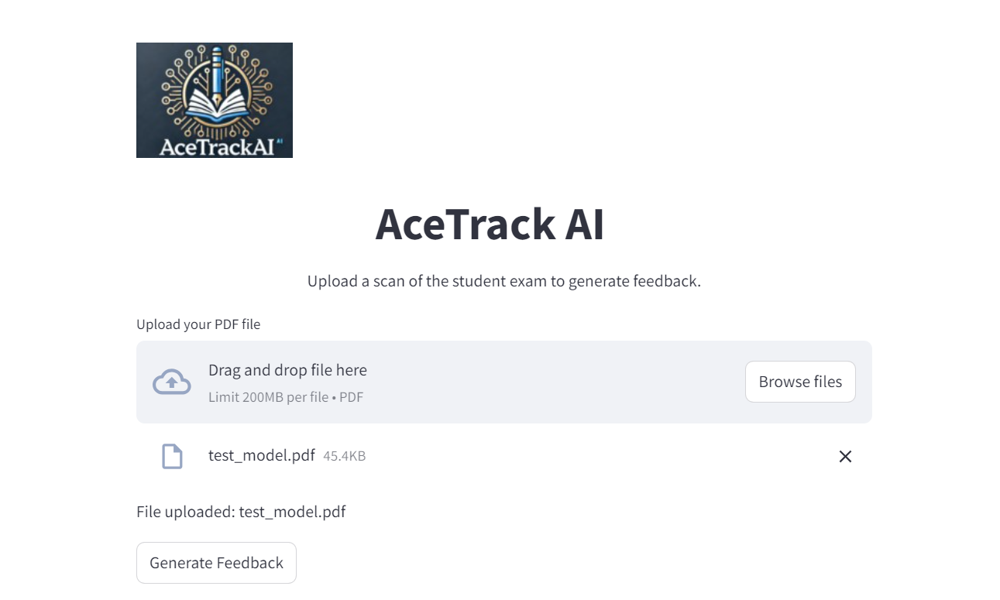
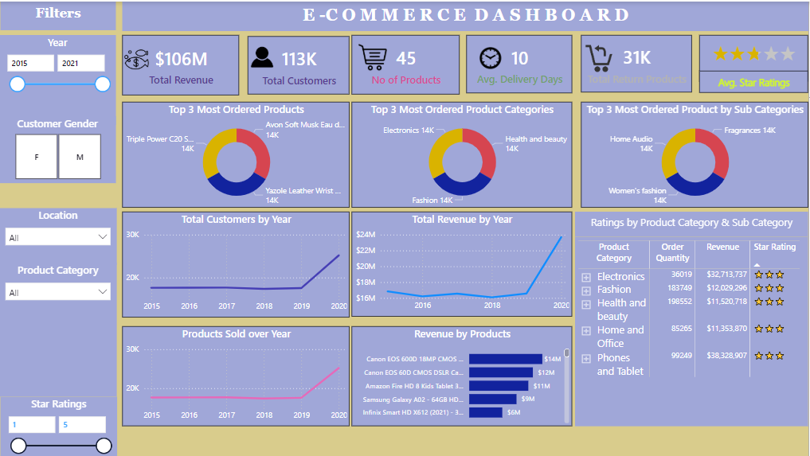

"""
<!-- ///////// NAME AND BADGES ///////// -->

  <h1 align="justify"><b>Hi, I'm Abdellahi El Moustapha!</h1>
   

  &nbsp;
 

<!-- ///////// ANIMATED BIO TEXT ///////// -->
[
](https://git.io/typing-svg)

    
<!-- ///////// PROJECTS SECTION ///////// -->
<h2 align="center">My Recent Projects 💻</h2>
 

<!-- Table layout for 6 projects -->
<table align="center">
  <tr>
    <!-- Project 1 -->
    <td align="center">
      
      <h3>
        <a href="https://github.com/Abmstpha/NLP" target="_blank">Neologism Translator</a>
      </h3>
    </td>
    <!-- Project 2 -->
    <td align="center">
      
      <h3>
        <a href="https://github.com/Abmstpha/DeepLearning" target="_blank">Convolutional AutoEncoder</a>
      </h3>
    </td>
    <!-- Project 3 -->
    <td align="center">
      
      <h3>
        <a href="https://github.com/Abmstpha/BloodCells-YOLOv5" target="_blank">YOLOv5: Detecting Blood Cells</a>
      </h3>
    </td>
    </tr>
    <tr>

    <!-- Project 4 -->
    <td align="center">
      
      <h3>
        <a href="https://github.com/Abmstpha/PowerBI" target="_blank">Credit Card Analysis</a>
      </h3>
    </td>
    <!-- Project 5 -->
    <td align="center">
      
      <h3>
        <a href="https://github.com/Abmstpha/AceTrackAI" target="_blank">AceTrack</a>
      </h3>
    </td>
    <!-- Project 6 -->
    <td align="center">
      
      <h3>
        <a href="https://github.com/Abmstpha/PowerBI" target="_blank">E-Commerce Dashboard</a>
      </h3>
    </td>
  </tr>
</table>

<!-- ////////// ABOUT ME ////////// -->  
<h2 align="justify">About Me 😃</h2>

Timezone: Europe/Paris (UTC+1)

I'm passionate about solving problems using data science and AI. I love learning and sharing my knowledge with others. When I'm not coding, you'll likely find me exploring new AI tools 🤓 📖 or engaging in youth-focused initiatives 🚀.

 
 
    
<!-- ////////// LANGUAGES AND TOOLS ////////// -->  
<h2>Languages and Tools</h2>

  
  
  
  
   
  

 
 
    
<!-- ////////// GITHUB STATS ////////// -->  
<h2 align="justify">Github Stats 📈 </h2>
 

"""
