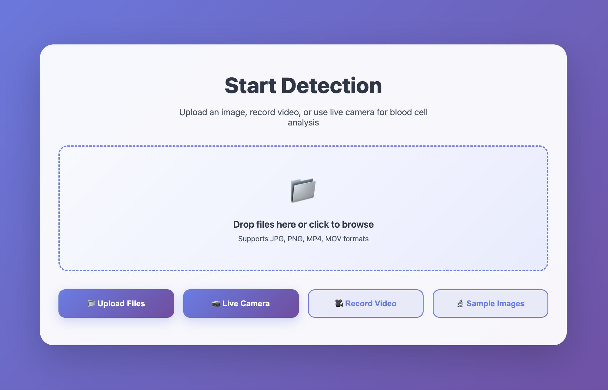

<!-- ///////// NAME AND BADGES ///////// -->

  

<h1 align="center">
  <b>Hiii, I'm Abdellahi El Moustapha!</b>
  
</h1>

  &nbsp;&nbsp;
  

<!-- ///////// ANIMATED BIO TEXT ///////// -->

  

 

## 🚀 About Me

- 🧠 I'm currently building AI agents evaluation system at **Norma Dev** and building the first European compliance-first Chatbot starter pack.
- 🎓 I'm pursuing a Master’s in **Artificial Intelligence & Data Science** at **Aivancity Paris**, graduating late 2026.
- 🛠️ I work on open source projects, voice-based onboarding agents, and intelligent matching systems.
- 🌍 I’m building projects worldwide.
- 💬 Ask me about LLM orchestration, RAG evaluation, LangChain, FastAPI, or anything AI-native.
- 🌱 Currently learning: advanced retrieval methods, ReAct + LangGraph, and agent memory design.

---

<!-- ///////// TECH STACK SECTION ///////// -->
<h2 align="center">🛠️ Tech Stack & Tools</h2>

  <table>
    <tr>
      <td align="center" width="96">
        
         Python
      </td>
      <td align="center" width="96">
        
         R
      </td>
      <td align="center" width="96">
        
         TensorFlow
      </td>
      <td align="center" width="96">
        
         PyTorch
      </td>
      <td align="center" width="96">
        
         SQL
      </td>
      <td align="center" width="96">
        
         Docker
      </td>
    </tr>
    <tr>
      <td align="center" width="96">
        
         AWS
      </td>
      <td align="center" width="96">
        
         Git
      </td>
      <td align="center" width="96">
        
         VS Code
      </td>
      <td align="center" width="96">
        
         Jupyter
      </td>
      <td align="center" width="96">
        
         JavaScript
      </td>
      <td align="center" width="96">
        
         HTML/CSS
      </td>
    </tr>
  </table>

  

<!-- ///////// PROJECTS SECTION ///////// -->
<h2 align="center">💻 My Recent Projects</h2>
 

<!-- Table layout for 6 projects -->
<table align="center" style="border-spacing: 20px;">
<tr>

<!-- Project 1: Neologism Translator -->
<td align="center" style="padding: 15px; border: 2px solid #30363d; border-radius: 10px; background: linear-gradient(135deg, #0d1117 0%, #161b22 100%);">
  
  
  
🔤 Neologism Translator

  

    Notebook → <code>src/</code> refactor for generating precise scientific terms from definitions (multilingual NLP). Clean repo layout: <code>src/</code>, <code>notebooks/</code>, <code>data/</code>, <code>models/</code>, <code>logs/</code>.
  

   
  

    
    
    
  

</td>

<!-- Project 2: Image Compression (Autoencoder) -->
<td align="center" style="padding: 15px; border: 2px solid #30363d; border-radius: 10px; background: linear-gradient(135deg, #0d1117 0%, #161b22 100%);">
  
  
  
🖼️ Image Compression (Conv Autoencoder)

  

    Dev-friendly repo for CIFAR-10 compression/reconstruction with a custom encoder–decoder, logs, and model checkpoints in dedicated folders.
  

   
  

    
    
    
  

</td>

</tr>
<tr>

<!-- Project 3: YOLOv5 Blood Cell Detection -->
<td align="center" style="padding: 15px; border: 2px solid #30363d; border-radius: 10px; background: linear-gradient(135deg, #0d1117 0%, #161b22 100%);">
  
  
  
🏥 YOLOv5: Blood Cell Detection

  
YOLOv5 model trained for detection/classification of blood cells (WBC, RBC, Platelets) in medical imaging datasets.

   
  

    
    
    
  

</td>

<!-- Project 4: Credit Card Analytics -->
<td align="center" style="padding: 15px; border: 2px solid #30363d; border-radius: 10px; background: linear-gradient(135deg, #0d1117 0%, #161b22 100%);">
  
  
  
💳 Credit Card Analytics

  
Power BI dashboards for analyzing credit card behavior, detecting fraud, and scoring financial risk.

   
  

    
    
    
  

</td>

</tr>
<tr>

<!-- Project 5: AceTrack AI -->
<td align="center" style="padding: 15px; border: 2px solid #30363d; border-radius: 10px; background: linear-gradient(135deg, #0d1117 0%, #161b22 100%);">
  
  
  
🧠 AceTrack AI

  
Upload student exam PDFs and get structured GPT-based feedback using OCR and AI evaluation logic.

   
  

    
    
    
  

</td>

<!-- Project 6: E-Commerce Dashboard -->
<td align="center" style="padding: 15px; border: 2px solid #30363d; border-radius: 10px; background: linear-gradient(135deg, #0d1117 0%, #161b22 100%);">
  
  
  
📊 E-Commerce Dashboard

  
Interactive dashboard for tracking product trends, customer behavior, and sales using Plotly Dash.

   
  

    
    
    
  

</td>

</tr>
</table>

  

<!-- ///////// GITHUB STATS SECTION ///////// -->
<h2 align="center">📊 GitHub Statistics</h2>

  
  

  

  

 

<!-- ///////// CONTACT & SOCIAL SECTION ///////// -->
<h2 align="center">🌐 Connect With Me</h2>

  &nbsp;&nbsp;
  &nbsp;&nbsp;
  

 

<!-- ///////// INSPIRATIONAL QUOTE ///////// -->

  

 

<!-- ///////// FOOTER ///////// -->

  
  
  <h3>💫 Thanks for visiting my profile!</h3>

  

    

  <strong>⭐ From <a href="https://github.com/Abmstpha">Abdellahi El Moustapha</a>  Building the future with data, one algorithm at a time! 🚀</strong>

