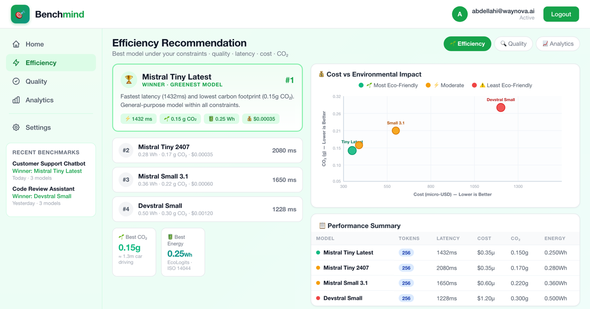
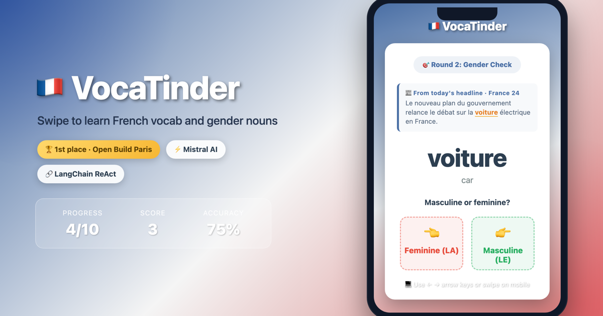
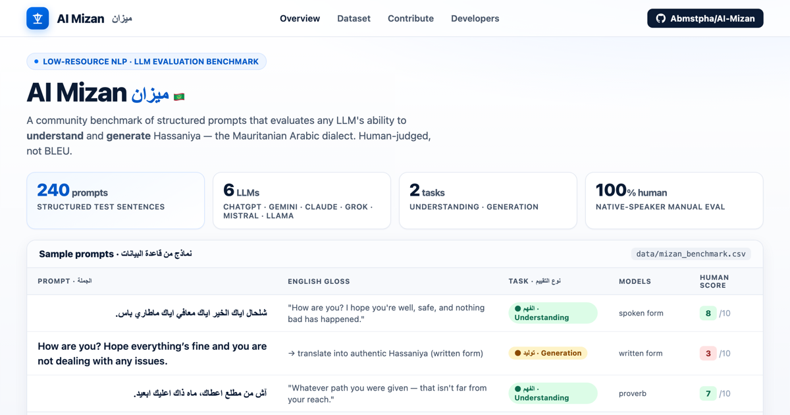
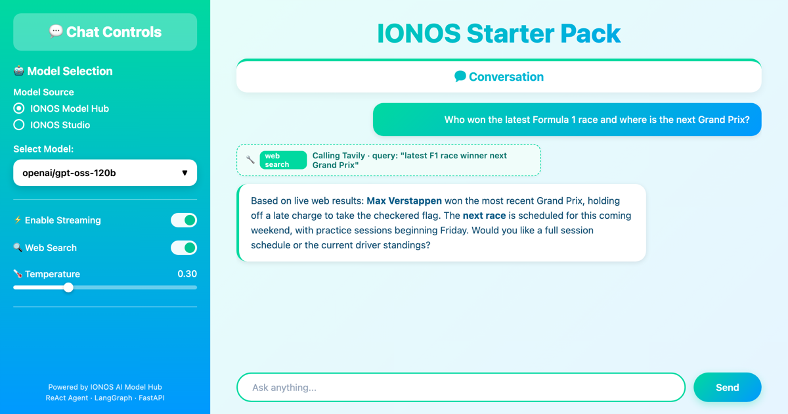
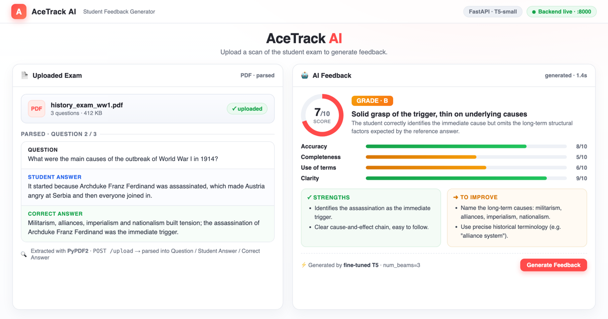
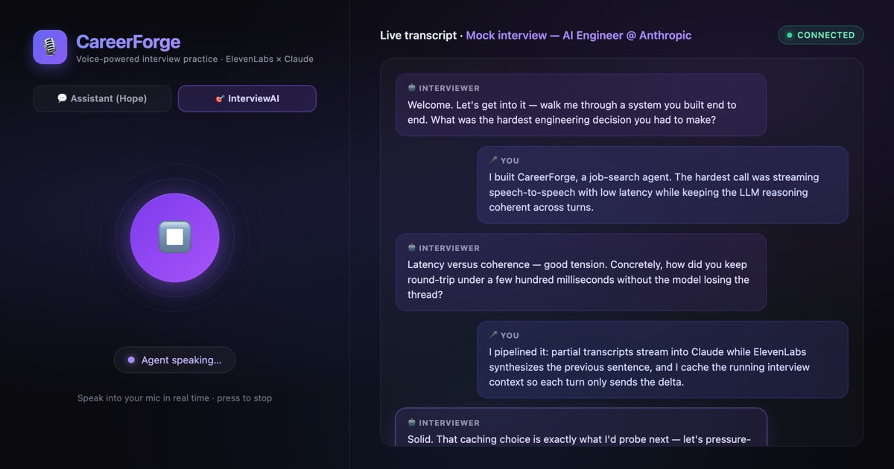
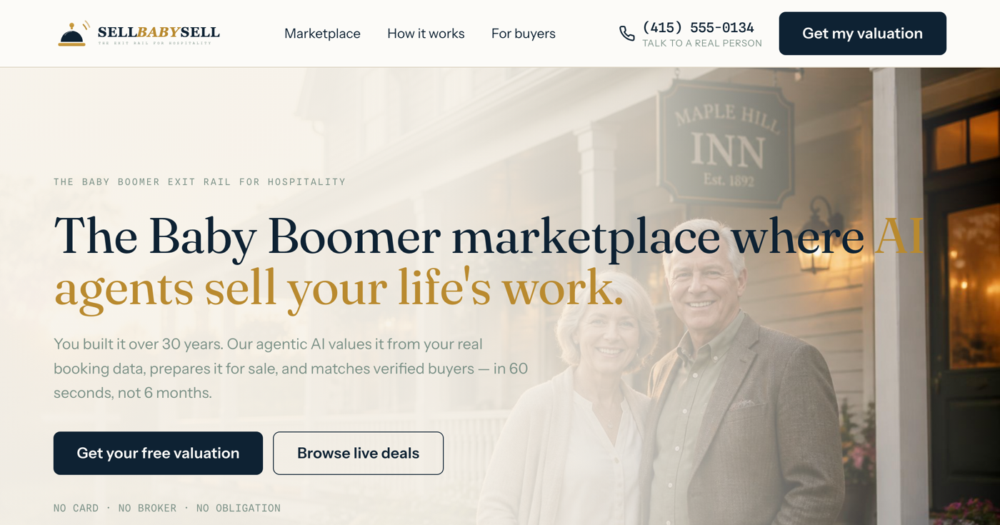

<!-- ///////// NAME AND BADGES ///////// -->

  

<h1 align="center">
  <b>Hiii, I'm Abdellahi El Moustapha!</b>
  
</h1>

  &nbsp;&nbsp;
  

<!-- ///////// ANIMATED BIO TEXT ///////// -->

  

 

## 🚀 About Me

- 🧠 I'm currently building AI agents evaluation system at **Norma Dev** and building the first European compliance-first Chatbot starter pack.
- 🎓 I'm pursuing a Master’s in **Artificial Intelligence & Data Science** at **Aivancity Paris**, graduating late 2026.
- 🛠️ I work on open source projects, voice-based onboarding agents, and intelligent matching systems.
- 🌍 I’m building projects worldwide.
- 💬 Ask me about LLM orchestration, RAG evaluation, LangChain, FastAPI, or anything AI-native.
- 🌱 Currently learning: advanced retrieval methods, ReAct + LangGraph, and agent memory design.

---

<!-- ///////// TECH STACK SECTION ///////// -->
<h2 align="center">🛠️ Tech Stack & Tools</h2>

  <table>
    <tr>
      <td align="center" width="96">
        
         Python
      </td>
      <td align="center" width="96">
        
         R
      </td>
      <td align="center" width="96">
        
         TensorFlow
      </td>
      <td align="center" width="96">
        
         PyTorch
      </td>
      <td align="center" width="96">
        
         SQL
      </td>
      <td align="center" width="96">
        
         Docker
      </td>
    </tr>
    <tr>
      <td align="center" width="96">
        
         AWS
      </td>
      <td align="center" width="96">
        
         Git
      </td>
      <td align="center" width="96">
        
         VS Code
      </td>
      <td align="center" width="96">
        
         Jupyter
      </td>
      <td align="center" width="96">
        
         JavaScript
      </td>
      <td align="center" width="96">
        
         HTML/CSS
      </td>
    </tr>
  </table>

  

<!-- ///////// PROJECTS SECTION ///////// -->
<h2 align="center">💻 My Recent Projects</h2>
 

<!-- Table layout for 6 projects -->
<table align="center" style="border-spacing: 20px;">
<tr>

<!-- Project 1: Benchmind -->
<td align="center" style="padding: 15px; border: 2px solid #30363d; border-radius: 10px; background: linear-gradient(135deg, #0d1117 0%, #161b22 100%);">
  
  
  
🧠 Benchmind

  

    Autonomous AI consultant that picks the optimal model across quality, cost, and carbon footprint — combining real-time benchmarking with web-sourced quality data.
  

   
  

    
    
    
  

</td>

<!-- Project 2: VocaTinder -->
<td align="center" style="padding: 15px; border: 2px solid #30363d; border-radius: 10px; background: linear-gradient(135deg, #0d1117 0%, #161b22 100%);">
  
  
  
🃏 VocaTinder 🏆 1st place · Open Build Paris

  

    Agentic French-gender learning game built on ReAct agents, live French headlines, and swipeable quiz cards.
  

   
  

    
    
    
  

</td>

</tr>
<tr>

<!-- Project 3: AI-Mizan -->
<td align="center" style="padding: 15px; border: 2px solid #30363d; border-radius: 10px; background: linear-gradient(135deg, #0d1117 0%, #161b22 100%);">
  
  
  
⚖️ AI-Mizan

  
Structured prompt benchmark evaluating an LLM's ability to understand and generate Hassaniya, the Mauritanian Arabic dialect — written and spoken.

   
  

    
    
    
  

</td>

<!-- Project 4: IONOS AI Agent Starter Pack -->
<td align="center" style="padding: 15px; border: 2px solid #30363d; border-radius: 10px; background: linear-gradient(135deg, #0d1117 0%, #161b22 100%);">
  
  
  
🤖 IONOS AI Agent Starter Pack

  
Full-stack ReAct agent on IONOS AI — real-time web search, dual model support (Hub & Studio), and streaming responses, ready for production.

   
  

    
    
    
  

</td>

</tr>
<tr>

<!-- Project 5: AceTrack AI -->
<td align="center" style="padding: 15px; border: 2px solid #30363d; border-radius: 10px; background: linear-gradient(135deg, #0d1117 0%, #161b22 100%);">
  
  
  
📝 AceTrack AI

  
Upload a student's exam PDF and get structured GPT-based feedback — OCR plus AI evaluation logic on a FastAPI backend.

   
  

    
    
    
  

</td>

<!-- Project 6: CareerAgent -->
<td align="center" style="padding: 15px; border: 2px solid #30363d; border-radius: 10px; background: linear-gradient(135deg, #0d1117 0%, #161b22 100%);">
  
  
  
🎙️ CareerForge

  
Voice-powered AI mock-interview coach — real-time speech-to-speech interview practice with a cloned-voice interviewer agent.

   
  

    
    
    
  

</td>

</tr>
<tr>

<!-- Project 7: Sell Baby Sell (flashdeal) -->
<td colspan="2" align="center" style="padding: 15px; border: 2px solid #30363d; border-radius: 10px; background: linear-gradient(135deg, #0d1117 0%, #161b22 100%);">
  
  
🏨 Sell Baby Sell 🏆 RAISE 2026 Hackathon

  
The exit rail for hospitality — turns a Paris-region property into an investor-ready, fully underwritten deal from a single address in about a minute. A <b>LangGraph Deep Agents</b> team (a Deal Lead orchestrator delegating to 7 managed subagents) runs valuation, compliance, financials, risk, and buyer matching, then ships a marketplace listing with a real data room.

   
  

    
    
    
    
    
  

</td>

</tr>
</table>

  

<!-- ///////// GITHUB STATS SECTION ///////// -->
<h2 align="center">📊 GitHub Statistics</h2>

  
  

  

  

 

<!-- ///////// CONTACT & SOCIAL SECTION ///////// -->
<h2 align="center">🌐 Connect With Me</h2>

  &nbsp;&nbsp;
  &nbsp;&nbsp;
  

 

<!-- ///////// INSPIRATIONAL QUOTE ///////// -->

  

 

<!-- ///////// FOOTER ///////// -->

  
  
  <h3>💫 Thanks for visiting my profile!</h3>

  

    

  <strong>⭐ From <a href="https://github.com/Abmstpha">Abdellahi El Moustapha</a>  Building the future with data, one algorithm at a time! 🚀</strong>

