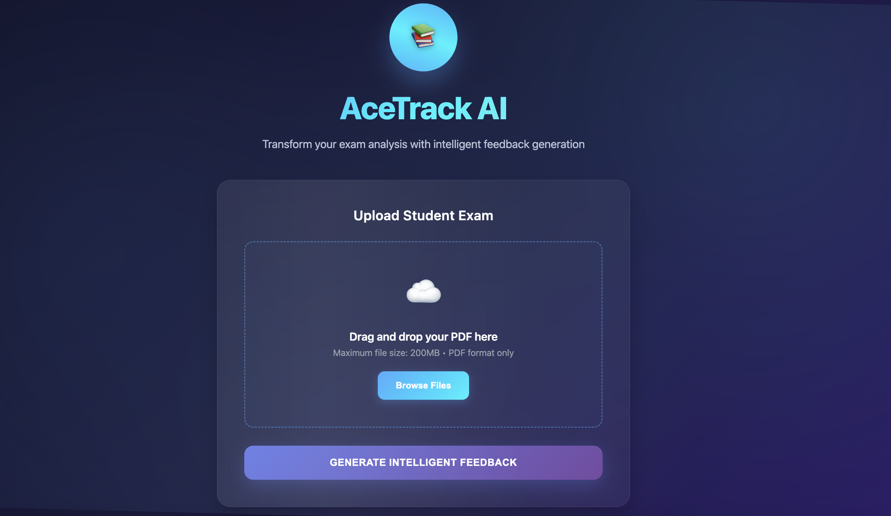

"""
<!-- ///////// NAME AND BADGES ///////// -->

  <h1 align="justify"><b>Hi, I'm Abdellahi El Moustapha!</h1>
   

  &nbsp;
 

<!-- ///////// ANIMATED BIO TEXT ///////// -->
[
](https://git.io/typing-svg)

    
<!-- ///////// PROJECTS SECTION ///////// -->
<h2 align="center">My Recent Projects 💻</h2>
 

<!-- Table layout for 6 projects -->
<table align="center">
  <tr>
    <!-- Project 1 -->
    <td align="center">
      
      <h3>
        <a href="https://github.com/Abmstpha/NLP" target="_blank">Neologism Translator</a>
      </h3>
    </td>
    <!-- Project 2 -->
    <td align="center">
      
      <h3>
        <a href="https://github.com/Abmstpha/DeepLearning" target="_blank">Convolutional AutoEncoder</a>
      </h3>
    </td>
    <!-- Project 3 -->
    <td align="center">
      
      <h3>
        <a href="https://github.com/Abmstpha/BloodCells-YOLOv5" target="_blank">YOLOv5: Detecting Blood Cells</a>
      </h3>
    </td>
  </tr>
  <tr>
    <!-- Project 4 -->
    <td align="center">
      
      <h3>
        <a href="https://github.com/Abmstpha/PowerBI" target="_blank">Credit Card Analysis</a>
      </h3>
    </td>
    <!-- Project 5 -->
    <td align="center">
      
      <h3>
        <a href="https://github.com/Abmstpha/AceTrackAI" target="_blank">AceTrack</a>
      </h3>
    </td>
    <!-- Project 6 -->
    <td align="center">
      
      <h3>
        <a href="https://github.com/Abmstpha/PowerBI" target="_blank">E-Commerce Dashboard</a>
      </h3>
    </td>
  </tr>
</table>

<!-- ///////// ABOUT ME ///////// -->  
<h2 align="center">Who Am I? 🤔</h2>

   Based in the vibrant city of Paris, France, I am an engineer and Master’s student specializing in Data Science and AI. My journey is driven by a passion for solving real-world challenges using cutting-edge technologies in Machine Learning, Deep Learning, and Data Analysis. 

   As a lifelong learner, I continuously explore tools like Python, R, and Power BI to enhance my expertise. Beyond academics and professional work, I am the proud founder of Mauritania's largest data community, ESP DATA CLUB, where I strive to inspire and share knowledge with others.

   When I'm not immersed in code or models, you’ll find me brainstorming innovative solutions, mentoring youth, or collaborating on impactful projects to shape a better future. 🚀

 
 
    
<!-- ////////// LANGUAGES AND TOOLS ////////// -->  
<h2>Languages and Tools</h2>

  
  
  
  
   
  

 
 
    
<!-- ////////// GITHUB STATS ////////// -->  
<h2 align="justify">Github Stats 📈 </h2>
 

"""
